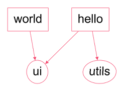

# [Lerna](https://github.com/nelsieborja/monorepos/tree/main/lerna) vs. [Nx](https://github.com/nelsieborja/monorepos/tree/main/nx) vs. [Rush](https://github.com/nelsieborja/monorepos/tree/main/rush)

## Criteria

- DX (Developer experience)
- Build execution time

The same set of packages (see below dependencies) were created for each tool, this setup was then used to obtain the results of the above criteria.

This dependency graph was created with _Nx_ `affected:dep-graph`.

## The verdict

### DX

- _Lerna_ - overall setup was easy. It provides features mainly for publishing npm packages, so when it comes to creating projects, you have to do yourself all the code setup. Sharing of code can easily be done in just 2 steps.
- _Nx_ - has the most convenient and easiest setup. With the _Nx_ CLI, you can quickly scaffold new projects in a consistent and standardize fashion. Code sharing is done instantly, no extra step needed.
- _Rush_ - not an easy one to get started with. You have to follow some steps as part of configuring things, otherwise you mess things up. Same as Lerna, features are mainly for publishing and managing npm package. Sharing of code requires extra steps and you might also face some issue.

### Build execution time

TBA

## Setup guide

You can check the step-by-step guide added for each tool inside their own folder or just use the below links:

- [Lerna (ft. Yarn Workspaces)](https://github.com/nelsieborja/monorepos/tree/main/lerna)
- [Nx](https://github.com/nelsieborja/monorepos/tree/main/nx)
- [Rush](https://github.com/nelsieborja/monorepos/tree/main/rush)
